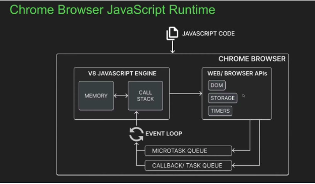

# Introduction to Node JS

## What is Node.js?

Node.js is an **open-source**, **cross-platform** JavaScript runtime environment.

- **Open-source**: The source code is publicly available for sharing and modification.
- **Cross-platform**: Node.js can work on Mac, Windows, and Linux.
- **JavaScript Runtime Environment**: Provides all the necessary components to use and run JavaScript programs outside the browser.

---

## Why Learn Node.js?

- Enables building **end-to-end JavaScript applications**.
- Widely adopted by major companies like **LinkedIn**, **Netflix**, and **PayPal**, which have migrated to Node.js from other technologies.
- Mastering Node.js is a key aspect of **full-stack development**, one of the most sought-after skill sets.
- Has a **large and supportive community**.

---

## Course Structure

1. **Understanding Node.js**
2. **Modules**
   - User-defined modules
   - Built-in modules
3. **Node.js Internals**
4. **npm**
   - Package management
5. **CLI Tools**
6. Miscellaneous Topics

---

## History of Node.js

### Netscape

- **1993**: Mosaic, the first web browser with a user interface, was released.
- **1994**: Netscape Navigator, a more polished browser, was launched by the developers of Mosaic.
- **1995**: Netscape created **JavaScript**, a scripting language, for adding interactivity to web pages. The name was a marketing strategy to leverage the popularity of Java.

### Microsoft Entry

- **1995**: Microsoft launched Internet Explorer.
- Microsoft reverse-engineered Netscape's JavaScript interpreter to create **JScript**, leading to browser incompatibilities.
- Developers had to optimize their websites separately for each browser.

### ECMAScript Standardization

- **1996**: Netscape submitted JavaScript to **Ecma International** for standardization.
  - Ecma International ensures consistent implementation across browsers.
- The JavaScript standard is called **ECMA-262**.
- **ECMAScript** refers to the standardized language, while **JavaScript** is the implementation used in practice.

---

## JavaScript Engine

JavaScript engines convert JavaScript code into machine code for execution.

- Developed primarily by browser vendors.

- 

### Popular JavaScript Engines

- **V8**: Open-source engine by Google for Chrome.
- **SpiderMonkey**: Powers Mozilla Firefox.
- **JavaScriptCore**: Developed by Apple for Safari.
- **Chakra**: Used in the original Microsoft Edge (modern Edge uses V8).

---

## Chrome's V8 Engine & Node.js

- **V8** is the open-source JavaScript engine by Google.
- Implements **ECMAScript** as specified by ECMA-262.
- Written in **C++** and used in Google Chrome.
- Can be embedded into any C++ application, enabling:
  - Execution of JavaScript code.
  - Adding new features to JavaScript.

### Node.js and V8

- **Node.js** embeds the V8 engine within a C++ program.
- This integration allows JavaScript to:
  - Perform lower-level operations like file handling, database connections, and network operations.
  - Extend functionality beyond the browser.

---

## JavaScript Runtime

A JavaScript runtime provides all necessary components to execute JavaScript programs.

- Every browser has a JavaScript runtime.
- **Node.js** extends this runtime to execute JavaScript outside the browser.

---

## What Can You Build with Node.js?

- Traditional websites
- Backend services like APIs
- Real-time applications
- Streaming services
- CLI tools
- Multiplayer games

Node.js enables the creation of complex and powerful applications.

---

## Summary

- **Node.js** is an open-source, cross-platform JavaScript runtime environment.
- It is **not a language** or a **framework**.
- Executes JavaScript code outside the browser.

---
